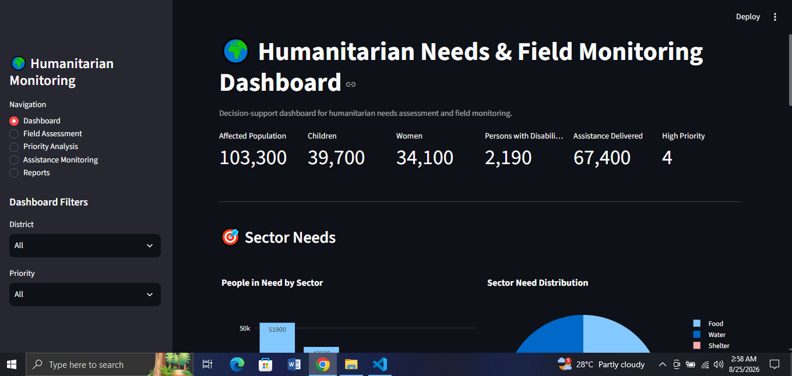

# 🌍 Humanitarian Needs & Field Monitoring Dashboard

An interactive humanitarian monitoring and needs assessment dashboard built with Python and Streamlit.

## 🚀 Live Demo

👉 https://humanitarian-needs-field-monitoring-dashboard.streamlit.app/

## 📸 Dashboard Preview



## 📌 Project Overview

This project is a humanitarian needs assessment and field monitoring dashboard designed to support data-driven decision-making in humanitarian response operations.

The system allows users to monitor affected populations, identify sector-specific needs, assess priority locations, track assistance delivery, and generate district-level monitoring reports.

The project uses synthetic data for educational and portfolio purposes.

## 🎯 Objectives

- Monitor affected populations across different locations
- Identify humanitarian needs by sector
- Assess vulnerable population groups
- Prioritize locations based on humanitarian needs
- Monitor assistance delivery and coverage
- Generate district-level monitoring reports
- Provide downloadable assessment data
- Demonstrate humanitarian data analysis and visualization

## 📊 Key Features

### 📍 Field Assessment

- Add new field assessment records
- Record affected population
- Track children, women, and persons with disabilities
- Record food, water, health, shelter, and education needs
- Record assistance delivered
- Assign assessment priority

### 🚨 Priority Analysis

- Calculate humanitarian priority scores
- Rank locations based on needs and vulnerability
- Identify critical and high-priority locations
- Visualize priority distribution

### 📦 Assistance Monitoring

- Monitor identified humanitarian needs
- Track assistance delivered
- Calculate remaining assistance gaps
- Calculate assistance coverage
- Compare assistance coverage across districts

### 📑 Reporting

- Generate district-level monitoring reports
- View affected population statistics
- Monitor assistance delivery
- Track high-priority locations
- Download reports as CSV files

## 🛠️ Technologies Used

- Python
- Streamlit
- Pandas
- Plotly
- SQLite
- Git & GitHub

## 🗄️ Database

The application uses SQLite for local data storage.

Main database entity:

`field_assessments`

The database stores:

- Assessment date
- District
- Upazila
- Affected population
- Children
- Women
- Persons with disabilities
- Food needs
- Water needs
- Health needs
- Shelter needs
- Education needs
- Assistance delivered
- Priority

## 🔄 Data Workflow

```text
Field Assessment
       ↓
SQLite Database
       ↓
Data Processing with Pandas
       ↓
Needs Analysis
       ↓
Priority Scoring
       ↓
Assistance Monitoring
       ↓
Interactive Dashboard
       ↓
Reports & CSV Export

```

## ⚙️ Installation & Usage

```bash
git clone https://github.com/mdisrak21/humanitarian-needs-field-monitoring-dashboard.git
cd humanitarian-needs-field-monitoring-dashboard
pip install -r requirements.txt
streamlit run app.py
```

## 🔮 Future Improvements

- Add map-based field monitoring.
- Add real-time data synchronization.
- Add downloadable situation reports.
- Add user-based data entry.